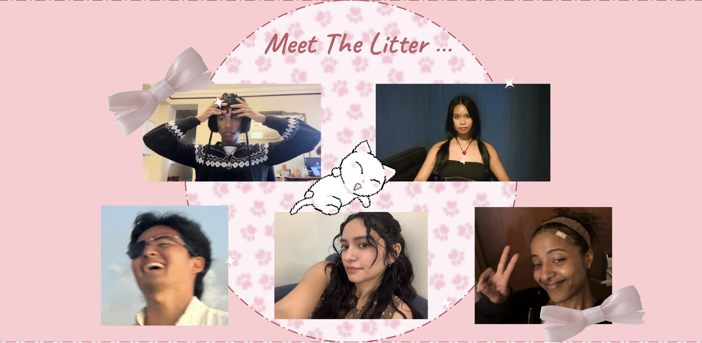

# Kis


# Introduction:
There was once a cat, and her name was Kis. She double majored in computer science and felinology (study of cats)
at the Kitties Tech University. In her junior year of college she realized there were no programming languages designed by cats, they were all designed by these weird beings called, "humans." In the Spring of 2024, Kis set off to design her own programming language and named it after herself. Instead of using words like "print", "for", "while", "end", "function",  "class", and "return", she chose words cats are more familiar with. In addition to that, this is how she described her language...

Kis is a sophisticated, statically-typed programming language designed by a cat, for all cats! Kis has several distinctive features. First, Kis features a module system, complete with import/export capabilities, encouraging modularity and code reuse. Second, Kis allows for more simple operator overloading with the built-in function 'addOrConcat()' which can concatenate expressions of any type. Lastly, Kis has several cat-themed keywords which allow this programming language to be fun and cat-friendly for any being who chooses to code with it.

# Meet the Litter...

Jerahmeel Mendoza, Kalif Byrd, Jordan Shiu, Joanna Estrada, Sarron Tadesse


# Features:

- Statically-Typed
- Module System
- Special cat-themed keywords
- Operator Overloading (addOrConcat())

## Keywords

| Kis              | Traditional |
| ---------------- | ----------- |
| meow             | print       |
| fur              | for         |
| whisker          | while       |
| nap              | end         |
| kitty            | function    |
| house            | class       |
| purr             | return      |

# Example Programs:

### Operator Overloading
<table>
<tr><th>Kis</th><tr>
</tr>
<td>

```
kitty addOrConcat(a,b):
    if isInt(a) && isInt(b):
        purr a+b
    
    else if isString(a) && isString(b):
        purr a+b

    else:
        purr null
    
    nap

nap

//Calculating and printing the results
set integerResult = addOrConcat(5,3)
set stringResult = addOrConcat("Hello, ", "world!")

meow(integerResult)
meow(stringResult)

```

</td>
</table>

### Module System

<table>
<tr><th>Javascript</th><th>Kis</th><tr>
</tr>

<td>

```javascript
//In a file named geometry.js:

function calculateArea(radius) {
    return 3.1415 * (radius**2) 
}
function square(num) {
    return num ** 2
}

export{calculateArea, square}

// In a different file:
import { calculateArea, square} from './geometry.js';
const circleArea = calculateArea(5.0)
console.log(circleArea)
```

```
// In any file:
module geometry
    export kitty calculateArea(radius: float):
        purr 3.14 * radius * radius
    nap

    export kitty square(num:float):
        purr num * num
    nap
nap

// In a different file:
import geometry
set circleArea = geometry.calculateArea(5.0)
meow(circleArea)
```

</td>
</table>


### For-Loops

<table>
<tr> <th>JavaScript</th><th>Kis</th><tr>
</tr>

<td>

```javascript
const catNames = ["garfield", "cleopatra", "sphinx"];

for (let i = 0; i < catNames.length; i++) {
  console.log(catNames[i]);
}

for (let i = 0; i < catNames.length; i++) {
  if catNames[i] === "cleopatra" {
    console.log(catNames[i])
  }
}
```

</td>

<td>

```
set cats = ["garfield", "cleopatra", "sphinx"]

fur cat in cats:
    meow(cat)
nap

fur cat in cats:
    if cat == "cleopatra":
        meow(cat)
nap
```

<td>


# Kis Webpage:

<p><a href="https://jshiulmu.github.io">

</a></p>
Click me!
